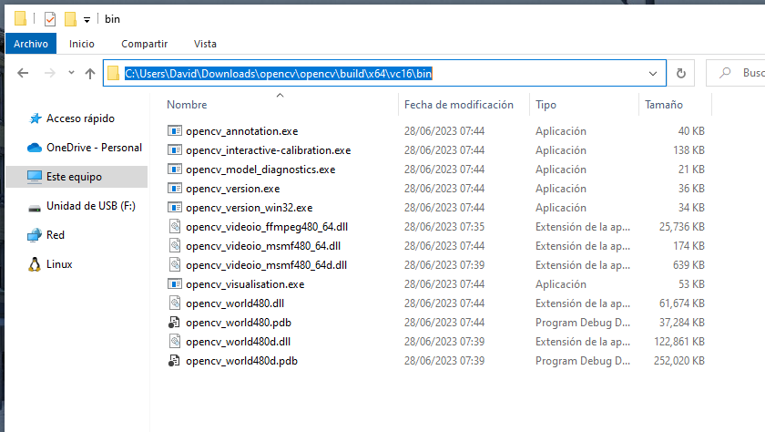
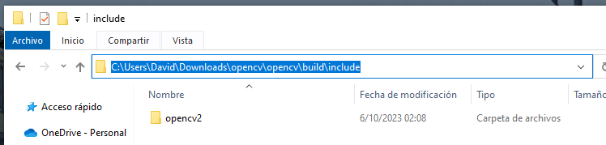
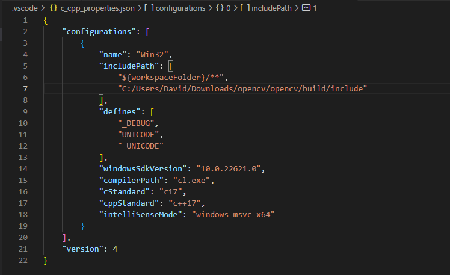

# Paso 1 del examen parcial.
Para compilar el codigo asegurarse de tener instalados los siguientes:  
  - cmake  
  - gcc  
  - OpemMP 
  - VSCode 

## Instalacion de OpenCV

### Windows 10
1. Descargar el instalador para Windows en https://opencv.org/releases/ 
2. Extraer OpenCV en la carpeta que prefiera  
  
3. Incluir la siguiente ruta en:  
    variables de entorno del sistema >> Path  
  
4. Incluir la siguiente ruta en:  
    variables del usuario >> Nuevo  
   
  
5. En el archivo de configuracion:  
     .vscode/c_cpp_properties.json
    agregar la siguiente ruta:  
  

  

## Compilacion
Ejecutar el archivo por lotes run.bat desde windows
